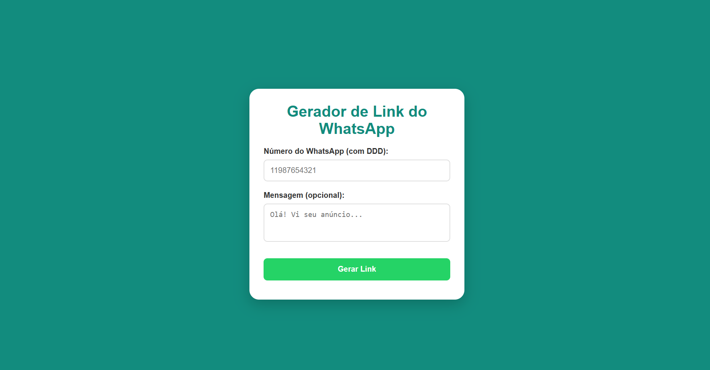

# Gerador de Links do WhatsApp

Projeto de estudo que gera automaticamente um link direto para iniciar uma conversa no WhatsApp, a partir de um número de telefone e uma mensagem pré-definida.

> 📚 Projeto feito acompanhando uma aula/curso, com foco em praticar manipulação do DOM e construção de URLs dinâmicas em JavaScript.

🔗 **Acesse:** https://gerador-de-links-whatsapp.vercel.app

## 🚀 Tecnologias

- HTML
- CSS
- JavaScript
- API do WhatsApp ([wa.me](https://wa.me))

## ✨ Funcionalidades

- Geração de link direto para o WhatsApp a partir de número e mensagem
- Construção dinâmica da URL usando template strings

## 💻 Rodando localmente

\`\`\`bash
git clone [https://github.com/samuelsilvaa/gerador-de-links-whatsapp.git]
cd nome-da-pasta